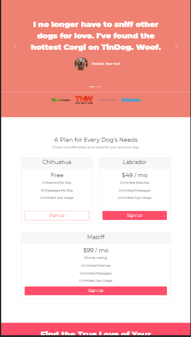

# Frontend Mentor - Stats preview card component solution

This is a solution to the [Stats preview card component challenge on Frontend Mentor](https://www.frontendmentor.io/challenges/stats-preview-card-component-8JqbgoU62).
Challenge-2 is TinDog (Tinder for Dog) website.

## Table of contents

- [Overview](#overview)
  - [The challenge](#the-challenge)
  - [Screenshot](#screenshot)
  - [Links](#links)
- [My process](#my-process)
  - [Built with](#built-with)
  - [What I learned](#what-i-learned)
- [Author](#author)

## Overview

### The challenge

Users should be able to:

- View the optimal layout depending on their device's screen size

### Screenshot

### Links

- Challenge1-Solution URL: [https://utkarshakumbhare.github.io/UIChallenges/index.html](https://utkarshakumbhare.github.io/UIChallenges/index.html)
- TinDog Live Site URL : [https://utkarshakumbhare.github.io/UIChallenges/challenge2-TinDog/index.html](https://utkarshakumbhare.github.io/UIChallenges/challenge2-TinDog/index.html)

## My process

- started with HTML for code structuring,
- then followed top down approach for each section
- For Tindog, understood CSS and Bootstrap5.

### Built with

- Semantic HTML5 markup
- CSS custom properties
- TinDog also uses Bootstrap5

### What I learned

- CSS filter, positioning, adding fallback colors and fonts
- Tag, id, class selectors. Bootstrap grid. Stacking & z-index. CSS Media queries.

## Author

- Website - [Utkarsha Kumbhare](https://www.your-site.com)
- Frontend Mentor - [@Utkarsha](https://www.frontendmentor.io/profile/Utkarsha)
